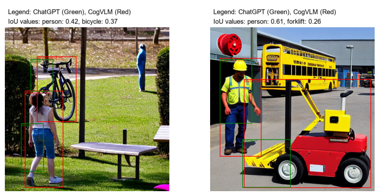

# InstanceDiffusion, Fully Automated: Leveraging LLMs for Efficiency in Image Generation.

--- 

### A. Stuger, A. Ibrahimi, L. Becker, R. van Emmerik, J. van der Lee

---

This project aims to reproduce and add an extension to the paper of ["InstanceDiffusion: Instance-level Control for Image Generation"](https://arxiv.org/abs/2402.03290) by Wang et al. (2024). Please refer to our [blogpost](blogpost.md) for detailed information on the implementation of our reproduction and extension of the [InstanceDiffusion model](https://github.com/frank-xwang/InstanceDiffusion).  

## Installation

### Requirements
- Linux or macOS with Python ≥ 3.8
- PyTorch ≥ 2.0 and [torchvision](https://github.com/pytorch/vision/) that matches the PyTorch installation.
  Install them together at [pytorch.org](https://pytorch.org) to make sure of this. 
- OpenCV ≥ 4.6 is needed by demo and visualization.

### Environment Setup
```bash
conda create --name instdiff python=3.8 -y
conda activate instdiff

pip install -r requirements.txt
```

Run the following script to download the [MSCOCO dataset](https://cocodataset.org/#home) (to [`src/lib/instancediffusion/datasets/`](src/lib/instancediffusion/dataset/)):
```bash
bash src/scripts/download_coco.sh
```

## Inference Demos

In order to run the Inference Demos of InstanceDiffusion locally, we provide [`src/lib/instancediffusion/inference.py`](src/lib/instancediffusion/inference.py) and multiple json files in [`src/lib/instancediffusion/demos`](src/lib/instancediffusion/demos), specifying text prompts and location conditions for generating specific images. In order to run these demos, please install the pretrained InstanceDiffusion from [Hugging Face](https://huggingface.co/xudongw/InstanceDiffusion/tree/main) or [Google Drive](https://drive.google.com/drive/folders/1Jm3bsBmq5sHBnaN5DemRUqNR0d4cVzqG?usp=sharing) and [SD1.5](https://huggingface.co/runwayml/stable-diffusion-v1-5/resolve/main/v1-5-pruned-emaonly.ckpt) and place them under the [`src/lib/instancediffusion/pretrained`](src/lib/instancediffusion/pretrained) folder. To run the different inference demos locally, use the bash scripts specified in [`src/scripts/inference_demos/`](src/scripts/inference_demos/) by running it using the following format:

```bash
bash src/scripts/inference_demos/bbox_demos/demo_cat_dog_robin.sh
bash src/scripts/inference_demos/iterative_generation/demo_iterative_r1.sh
bash src/scripts/inference_demos/point_demos/demo_corgi_kitchen.sh
```

The demo outputs are saved in the folder [`src/data/demo_outputs/`](src/data/demo_outputs/).

### InstanceDiffusion Demos

InstanceDiffusion enables image compositions with a granularity that ranges from entire instances to individual parts and subparts. The placement of these parts and subparts can inherently modify the object's overall pose.

https://github.com/frank-xwang/InstanceDiffusion/assets/58996472/1c4205a5-c3c4-4605-9fbd-c7023d4a4768

### Image Generation Using Single Points

InstanceDiffusion supports image generation by using points, with each point representing an instance, along with corresponding instance captions.

<p align="center">
  
</p>

### Iterative Image Generation
  InstanceDiffusion supports iterative image generation with minimal changes to pre-generated instances and the overall scene. By using the same initial noise and image caption, InstanceDiffusion can selectively introduce new instances, replace existing ones, reposition instances, or adjust their sizes by modifying the bounding boxes.

https://github.com/frank-xwang/InstanceDiffusion/assets/58996472/b161455a-6b21-4607-a59d-3a6dd19edab1

### Extension/GPT4o LLM Submodule

#### Demo: Generating images with LLM GPT4o submodule
Our approach automates the generation of image descriptions and bounding boxes using a Large Language Model (LLM). This method enhances the efficiency of the InstanceDiffusion Model, which supports precise instance-level control and flexible instance location specifications. For a detailed explanation, refer to the section [Leveraging LLM's for Modular Efficiency in InstanceDiffusion](blogpost.md##-Leveraging-LLM's-for-Modular-Efficiency-in-InstanceDiffusion). This following instructions demonstrate how to set up and use our LLM submodule to generate input data for InstanceDiffusion.

```bash
conda deactivate

conda create --name instdiff_llm python=3.8 -y
conda activate instdiff_llm

pip install -r requirements_llm.txt
```

```bash
python src/lib/llm_submodule/chatgpt/chatgpt_generate_input.py
```
You will be prompted to enter your ChatGPT API key. To request an API key for an existing user account, [click here](https://platform.openai.com/settings/profile?tab=api-keys). Next, specify the number of image descriptions you would like to generate using ChatGPT.
The requested image descriptions will be generated and saved in a folder (in src/lib/llm_submodule/chatgpt/chatgpt_data) named with a timestamp. This folder name will be printed on the terminal.

Next, create the images from the LLM-generated input descriptions.
```bash
./src/lib/llm_submodule/chatgpt/create_llm_images.sh
```
You will be prompted to enter the folder name (timestamp) where your input descriptions were saved. This ensures that the generated images correspond to the correct session. The images will now be generated.

Navigate to the output directory to view the generated images:
```bash
cd src/lib/llm_submodule/chatgpt/chatgpt_output
```
Inside, you will find a folder named with the same timestamp, containing:
1. A visualisation of the ChatGPT-defined bounding boxes.
2. The initial generated image based on the text prompt and instance-level conditions (bounding boxes), created using the main diffusion model without refinement.
3. Initial image after further quality enhancement using the SDXL refiner.

By following these steps, you will successfully generate and inspect images using the GPT-4 LLM submodule integrated with the InstanceDiffusion Model. To read about a quality assessment by inspection, [click here](blogpost.md##-Evaluation-of-LLM-Submodule). The next section will proceed to explain the evaluation of the LLM-based images using CogVLM.

#### Evaluation with CogVLM

Evaluating the alignment of the generated photos with the bounding boxes made by ChatGPT using CogVLM. Once the created photos are fed into CogVLM, it uses the bounding boxes to identify and outline the instances (predicted bounding boxes) within the images. The places where the instances have been deployed by the Instance Diffusion model are represented by these expected bounding boxes. On the other hand, ChatGPT's bounding boxes, which show the locations intended for instance generation, act as the ground truth.

<table align="center">
  <tr align="center">
      <th></th>
  </tr>
  <tr align="left">
    <td colspan=2>The image shows two side-by-side visualizations of bounding box predictions and ground truths for object detection, with ChatGPT's bounding boxes in green and CogVLM's bounding boxes in red, along with their respective IoU values for each detected object.</td>
  </tr>
</table>
 

## Evaluation
For evaluation, the [MSCOCO](https://cocodataset.org/#download) dataset is used. To evaluate, first make sure the MSCOCO dataset is installed using the script described in the environment installation above.
Ensure the data is organized as followed: 

```setup
coco/
  annotations/
    instances_val2017.json
  images/
    val2017/
      000000000139.jpg
      000000000285.jpg
      ...
```

Moreover, the customized [instances_val2017.json](https://drive.google.com/file/d/1sYpb7jRZJyBJYPFHyjxosIDaiQhkrEhU/view) file needs to be downloaded. This resizes all images to 512x512 and adjusts the corresponding masks/boxes accordingly.

### Reproducing results

To reproduce the results from the paper, please refer to the job files in [`src/scripts/jobs/reproduction`](src/scripts/jobs/reproduction). We reproduced three categories of evaluation studies from the paper: different location formats used as input when generating images (eval_mask & eval_box), results from using scribble- and point-based image generation (eval_PiM_point & eval_PiM_scribble) and attribution binding (eval_att_textures & eval_att_colors). All the scripts are found in the reproduction folder and can be run on the Snellius Cluster as follows:

#### Reproduction Instructions for the Snellius Cluster

To reproduce the results from the InstanceDiffusion paper, we ran multiple job files located in the folder [`src/scripts/jobs`](src/scripts/jobs). These jobs were run on the [Snellius Cluster](https://www.surf.nl/diensten/snellius-de-nationale-supercomputer), provided by the UvA. In order to reproduce our results in full, make sure to run the different scripts in the following manner:

```repository
git clone https://github.com/Jellemvdl/InstanceDiffusion-extension.git
cd InstanceDiffusion-extension/
```

To install the requirements, the coco dataset (to [`src/lib/instancediffusion/datasets/`](src/lib/instancediffusion/datasets/)) and the pretrained models (to [`src/lib/instancediffusion/pretrained/`](src/lib/instancediffusion/pretrained/)), run the following:

```requirements
sbatch src/jobs/install_env.job
```

In order to replicate the results from the paper, run each evaluation in [`src/scripts/jobs/reproduction`](src/scripts/jobs/reproduction) jobs as follows:
```evaluation
sbatch src/scripts/jobs/reproduction/eval_box.job
```

## Results

### Reproduction

As part of our reproduction study, we succesfully replicated the YOLO results achieved by the original authors for different location formats as input when generating images for Boxes and Instance masks: 
<table align="center">
  <tr align="center">
      <th align="left">Method</th>
      <th>AP<sub>box</sub></th>
      <th>AP<sub>box</sub><sup>50</sup></th>
      <th>AR<sub>box</sub></th>
  </tr>
  <tr align="center">
    <td align="left">InstanceDiffusion</td>
    <td>38.8</td>
    <td>55.4</td>
    <td>52.9</td>
  </tr>
  <tr align="center">
    <td align="left">Our Reproduction</td>
    <td>49.9</td>
    <td>66.8</td>
    <td>68.6</td>
  </tr>
  <tr align="center">
    <td align="left">Difference</td>
    <td>+11.1</td>
    <td>+11.4</td>
    <td>+15.7</td>
  </tr>
  <tr align="left">
    <td colspan=4><b>Table 1.</b> Evaluating different location formats when generating images of reproduction experiments using Bounding Boxes as input.</td>
  </tr>
</table>

<table align="center">
  <tr align="center">
      <th align="left">Method</th>
      <th>AP<sub>mask</sub></th>
      <th>AP<sub>mask</sub><sup>50</sup></th>
      <th>AR<sub>mask</sub></th>
  </tr>
  <tr align="center">
    <td align="left">InstanceDiffusion</td>
    <td>27.1</td>
    <td>50.0</td>
    <td>38.1</td>
  </tr>
  <tr align="center">
    <td align="left">Our Reproduction</td>
    <td>40.8</td>
    <td>63.5</td>
    <td>56.0</td>
  </tr>
  <tr align="center">
    <td align="left">Difference</td>
    <td>+13.7</td>
    <td>+13.5</td>
    <td>+17.9</td>
  </tr>
  <tr align="left">
    <td colspan=4><b>Table 2.</b> Evaluating different location formats when generating images of reproduction experiments using Instance Masks as input.</td>
  </tr>
</table>

In the same manner we reproduced the PiM values for scribble-/point-based image generation:
<table align="center">
  <tr align="center">
      <th align="left" rowspan="2">Method</th>
      <th colspan="1">Points</th>
      <th colspan="1">Scribble</th>
  </tr>
  <tr align="center">
      <th>PiM</th>
      <th>PiM</th>
  </tr>
  <tr align="center">
    <td align="left">InstanceDiffusion</td>
    <td>81.1</td>
    <td>72.4</td>
  </tr>
  <tr align="center">
    <td align="left">Our Reproduction</td>
    <td>..</td>
    <td>63.6</td>
  </tr>
  <tr align="center">
    <td align="left">Difference</td>
    <td>+..</td>
    <td>-8.8</td>
  </tr>
  <tr align="left">
    <td colspan=3><b>Table 3.</b> Evaluating different location formats as input when generating images of reproduction experiments for points and scribbles.</td>
  </tr>
</table>

Moreover, succesfully replicated the attribute binding results for colors and texture:

<table align="center">
  <tr align="center">
      <th align="left" rowspan="2">Methods</th>
      <th colspan="2">Color</th>
      <th colspan="2">Texture</th>
  </tr>
  <tr align="center">
      <th>A<sub>cc</sub><sup>color</sup></th>
      <th>CLIP<sub>local</sub></th>
      <th>A<sub>cc</sub><sup>texture</sup></th>
      <th>CLIP<sub>local</sub></th>
  </tr>
  <tr align="center">
    <td align="left">InstanceDiffusion</td>
    <td>54.4</td>
    <td>0.250</td>
    <td>26.8</td>
    <td>0.225</td>
  </tr>
  <tr align="center">
    <td align="left">Our Reproduction</td>
    <td>53.3</td>
    <td>0.248</td>
    <td>26.9</td>
    <td>0.226</td>
  </tr>
  <tr align="center">
    <td align="left">Difference</td>
    <td style="color:red;">-1.1</td>
    <td style="color:red;">-0.002</td>
    <td style="color:green;">+0.1</td>
    <td style="color:green;">+0.001</td>
  </tr>
    <tr align="left">
    <td colspan=7><b>Table 4.</b> Attribute binding reproduction results for color and texture.</td>
  </tr>  
</table>


